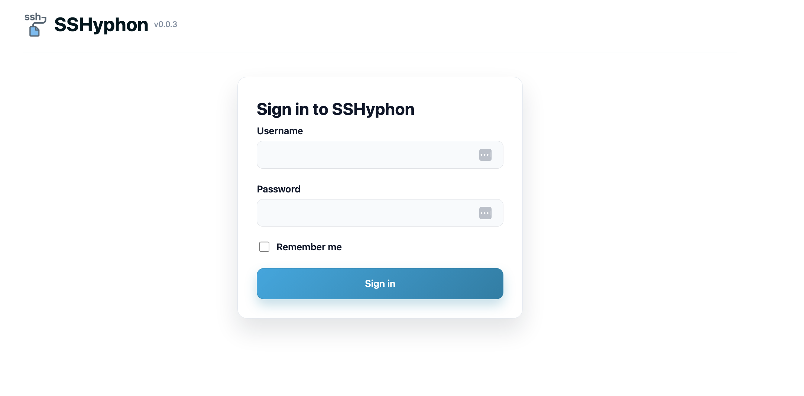

#  SSHyphon

SSHyphon (Siphon) is a Docker-native SFTP sync control surface with a FastAPI backend and React/Vite frontend—the name is a wink to “SSH hyphen” because it bridges secure shell workflows with clean separation between sync and UI. The web dashboard handles SFTP transfers, Jellyfin task orchestration, logging, and scheduling inside a single container.

## Screenshots
| Dashboard | Login | Configuration | Jellyfin |
| --- | --- | --- | --- |
| [](docs/SSHyphon_main.png) | [](docs/ssyhpon_login.png) | [](docs/sync_settings.png) | [](docs/jellyfin_tasks.png) |

## Highlights
- **Unified dashboard** – status tiles, transfer history, activity/error logs, and performant controls under one SPA.
- **SFTP sync engine** – Paramiko-driven transfers with live stats, progress, and Jellyfin task hooks, all coordinated from the UI.
- **Docker-native deployment** – multi-stage image, single Uvicorn process on port `8000`, and persistent logs/configs in `/data`.
- **Jellyfin orchestration** – configure Jellyfin servers and tasks, trigger runs alongside sync jobs, and monitor task status.
- **Background scheduling** – optional auto-sync keeps your mirror up to date on a configurable interval.

## Wiki
Check out the starting wiki pages under `docs/wiki` for setup, workflows, and operational guidance:
- [Wiki index](docs/wiki/README.md)
- [Getting started](docs/wiki/getting-started.md)
- [Syncing & Jellyfin tasks](docs/wiki/syncing-and-jellyfin.md)
- [Logs, backups, and recovery](docs/wiki/operations.md)
- [API Reference Guide](docs/wiki/api-reference.md)

## Test Results
<!-- CI-BADGE:START -->

<!-- CI-BADGE:END -->

<!-- TEST-RESULTS:START -->
**Last CI test run (Pacific Time): 2025-11-30 17:05:05 PST**

| Test | Result |
| --- | --- |
| Backend tests | ✅ |
| Frontend tests | ✅ |
<!-- TEST-RESULTS:END -->


## Getting Started
1. Clone the repo and build or pull the Docker image. The fastest path is `docker compose up --build` from the repo root.
2. Mount your target folder into the container (for example, `./local-sync` → `/local-sync`) so downloaded files persist on the host.
3. Open `http://localhost:8000` in a browser, set the **Local Root** to the path inside the container (e.g., `/local-sync`), and supply your SFTP credentials + Remote Root.
4. Save the configuration, then run a sync or enable auto-sync. Logs and recent transfers appear instantly in the UI.

## Docker & Compose
### Using the provided `compose.yml`
The included Compose file builds the multi-stage image and publishes the UI/API on port `8000`.

```bash
# build and run from the repository root
docker compose up --build
```

By default, `compose.yml` mounts two volumes:
- `./data` → `/data` for configs, secrets, and logs.
- `./local-sync` → `/local-sync` for the mirrored files (edit this path to match your real destination).

After the container starts, visit `http://localhost:8000` and set **Local Root** to `/local-sync` (or your edited mount path).

### Building manually with Docker
If you prefer a single `docker build`/`run` flow or need to adapt to another orchestrator, use the multi-stage `Dockerfile`:

```bash
# build the image
docker build -t sshyphon:latest .

# run it (adjust mounts for your host paths)
docker run -p 8000:8000 \
  -v $(pwd)/data:/data \
  -v $(pwd)/local-sync:/local-sync \
  sshyphon:latest
```

These commands mirror the Compose defaults: port `8000` serves the SPA + API, `/data` holds persistent state, and `/local-sync` is where synced files are written. Any Kubernetes or other YAML-based deployment can map the same volumes/port to achieve parity with the Compose setup.

### Minimal YAML example
For platforms that accept a plain YAML service definition, start with this snippet and adjust the host paths and ports for your environment:

```yaml
services:
  sshyphon:
    image: ghcr.io/mpassovoy/sshyphon:latest
    container_name: sshyphon
    restart: unless-stopped

    ports:
      - "8000:8000" ### update with desired port mapping

    volumes:
      - /mnt/tank/sshyphon:/data
      - /mnt/Main/folder:/local-sync  ### update with path to local storage for downloads
```

It mirrors the defaults from `compose.yml`: port `8000` exposes the web UI/API, `/data` stores configs and logs, and `/local-sync` hosts downloaded files. Update the mount points to match your storage layout.

## UI Features
- **Config sections** – SSH credentials, Jellyfin setup, and task management each have dedicated tabs with help text.
- **Status tiles** – show the worker state, last/next sync, Jellyfin errors, and quick actions (Start/Stop sync).
- **Recent transfers** – responsive table with totals, timestamps, and inline filters.
- **Logs** – activity and error logs can be refreshed, cleared, or downloaded with a single click (timestamped filenames).

## Troubleshooting
| Issue | Fix |
| --- | --- |
| Docker container cannot write to the local root | Ensure the host directory is mounted and the container user has write access (running as root is the easiest way). |
| “Missing credentials” when starting a sync | Fill every required form field and save the password once—saved secrets display as `********`. |
| Auto-sync is not firing | Confirm the toggle is on, the interval is ≥ 5 minutes, and the worker is idle. Saving a new config restarts the scheduler immediately. |
| Frontend returns 404 | The API serves the built SPA from `/app/frontend_dist`. Rebuild the frontend (`npm run build`) or rerun `docker compose build` whenever UI assets change. |

## Warnings & Legal
- The container can only write to directories you explicitly mount; verify your volume mappings before syncing.
- Secrets are stored in JSON under `/data`. For sensitive deployments, use an encrypted volume or external secret store.
- Do not sync material you are not authorized to distribute. You are solely responsible for compliance with copyright, licensing, and service terms.

