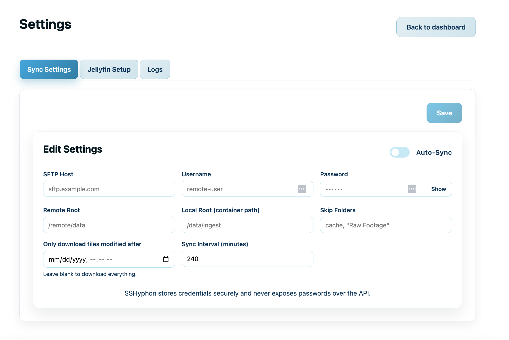
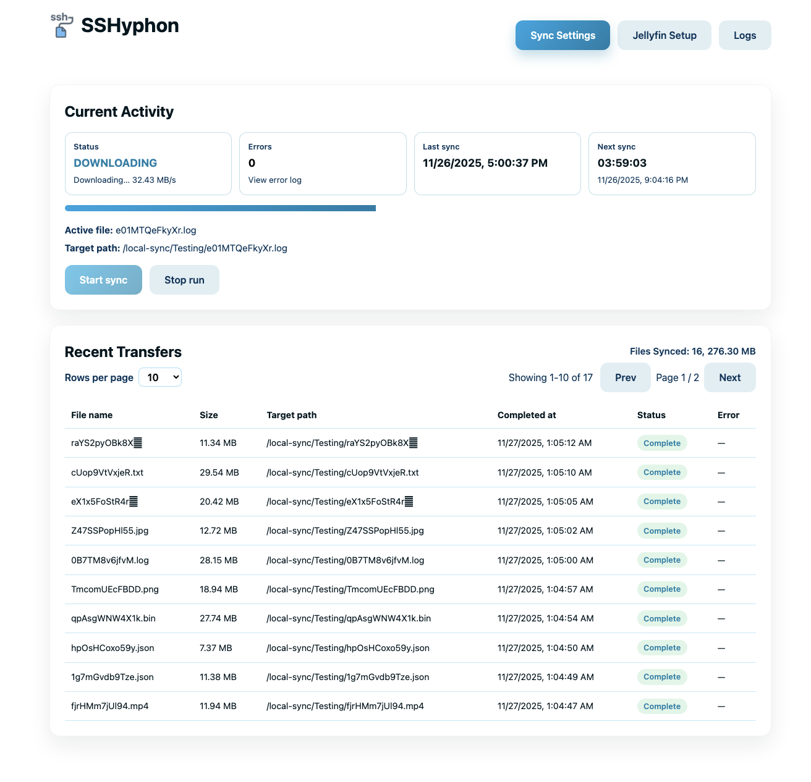
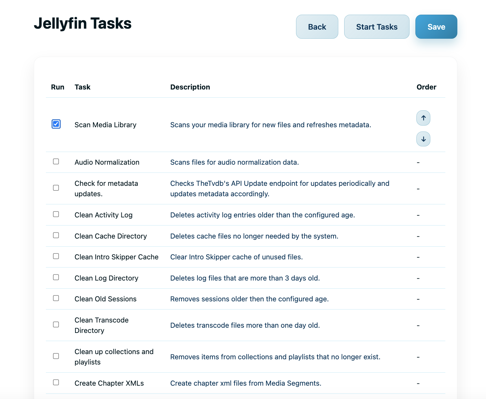

# Syncing & Jellyfin tasks

Configure SFTP sync jobs and orchestrate Jellyfin actions without leaving the SSHyphon dashboard.

## Configure a sync job
1. Go to **Settings → Sync Settings**.
2. Fill in the **Remote Root**, **Local Root**, and credentials (host, port, username, password/key).
3. Optionally set a **File Filter** pattern if you only want to mirror certain file types.
4. Click **Save Settings**.
5. Start a manual sync with **Start Sync** on the status tile.

## Enable scheduling
1. In **Settings → Sync Settings**, toggle **Auto-sync** on.
2. Choose an interval (e.g., every 15 minutes). The scheduler restarts when you save.
3. Confirm next-run time on the status tiles; the worker should show `Idle` until the next job triggers.

## Track progress
- **Recent Transfers** shows file counts, duration, and timestamps.
- **Logs** tab can be refreshed, cleared, or downloaded for auditing.
- For troubleshooting, review `/data/logs` inside the container or download logs from the UI.

## Jellyfin orchestration
1. In **Settings → Jellyfin**, enter the Jellyfin server URL and API key.
2. Define tasks under **Jellyfin Tasks** (e.g., library refresh) and save.
3. Trigger tasks manually or let them run after syncs, depending on your configuration.

## Common issues
- **Permission errors on Local Root**: ensure the host mount allows writes for the container user.
- **Scheduler not running**: confirm auto-sync is enabled and the interval is at least 5 minutes.
- **Jellyfin 401/403**: verify the API key and that the URL resolves from inside the container.
